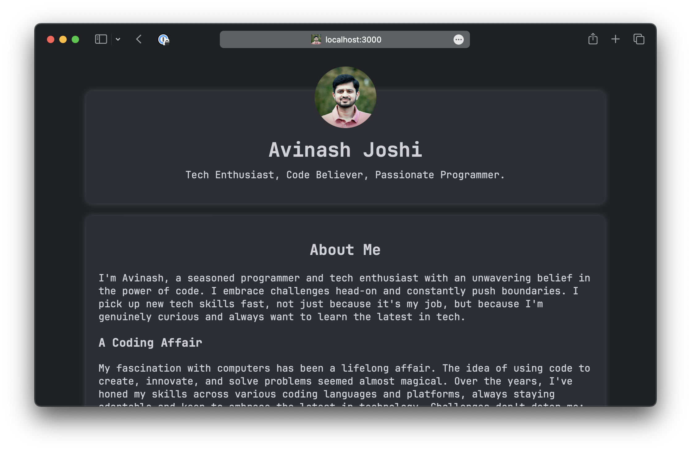

# Avinash Joshi's Personal Website

Welcome to the repository of my personal website.



## Features

- **Simple:** Simple straightforward implementation using HTML, CSS and Vanilla Javascript - works everywhere.
- **Responsive Design:** Ensures the website looks great on devices of all sizes.
- **Dark Mode Toggle:** Provides enhanced usability by allowing users to switch between light and dark themes.
- **Modern & Clean Font**: Uses the JetBrains Mono font for improved readability and aesthetics.

## Tech Stack

- HTML5
- CSS3
- Vanilla JavaScript

## Hosting

This website is hosted using [GitHub Pages](https://pages.github.com/).

## Local Development

To get started with local development:

1. **Clone the repository:**

   ```bash
   git clone https://github.com/avinashjoshi/avinashjoshi.github.io.git

   ```

2. **Navigate to the directory:**

   ```bash
   cd avinashjoshi.github.io
   ```

3. To serve the website locally, use a lightweight HTTP server **OR** Open `index.html` in your favorite browser
   ```bash
   python3 -m http.server 3000
   ```

## Contributions

This is my personal portfolio website and I'm not looking for any direct contributions.
However, if you find any bugs or have suggestions, please open an issue.

## License

This project is open source and available under the [MIT License](LICENSE).

## Developer tips

- [Creating WebP Images with the Command Line](https://web.dev/articles/codelab-serve-images-webp)
  ```bash
  `for file in *; do cwebp -q 90 "$file" -o "${file%.*}.webp"; done`
  ```
